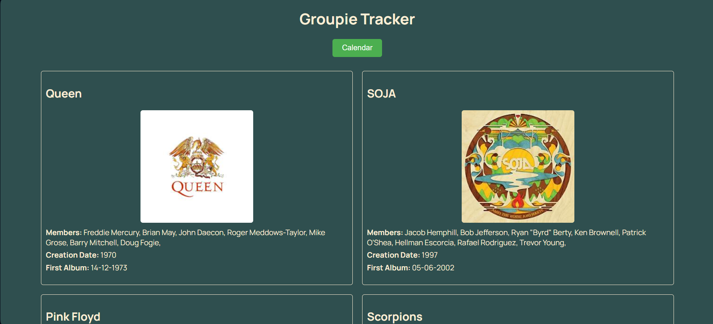
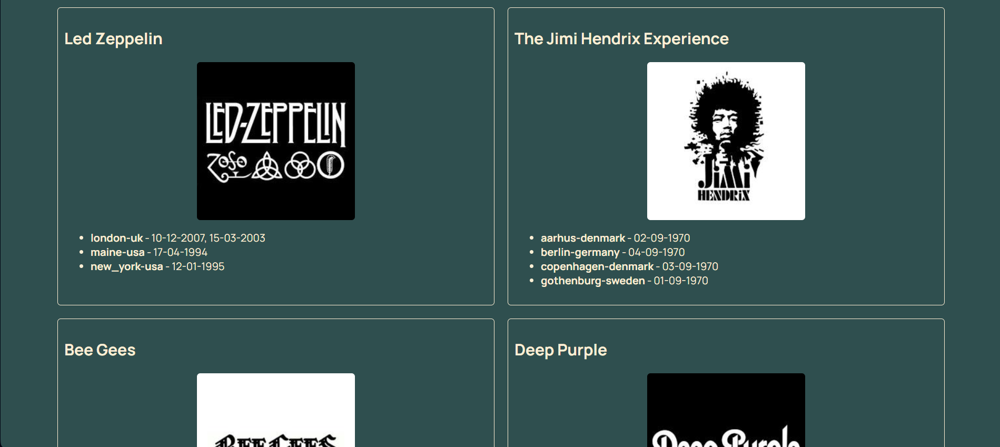

# Groupie Tracker




Groupie Tracker is a web application written in Go that tracks music groups and their concert dates. The application uses the `Groupie Tracker` API to fetch and display data about artists and their concert schedules.

## Installation

Clone the repository to your local environment:

```bash
git clone https://github.com/tzeytun/groupie-tracker.git
cd groupie-tracker
```

Install the necessary dependencies and run the project:

```bash
go mod tidy
go run main.go
```

The server will run by default at `http://localhost:8080`.

## Usage

- `http://localhost:8080/` : Displays information about artists.
- `http://localhost:8080/relation` : Displays the concert calendar for artists.

## Project Structure

`main.go`: The main Go file. Starts the HTTP server and contains two main handlers for displaying artist information and concert dates.

`artistHandler`: Fetches artist information and renders it using the `static/main.html` template.

`RelationHandler`: Fetches concert dates and renders them using the `static/relation.html` template.

`static/`: Static files directory.

`main.html`: HTML file for displaying artist information.

`relation.html`: HTML file for displaying the concert calendar.

## API

This project uses the Groupie Tracker API:

- `https://groupietrackers.herokuapp.com/api/artists`: Fetches artist information.
- `https://groupietrackers.herokuapp.com/api/relation`: Fetches concert dates.
